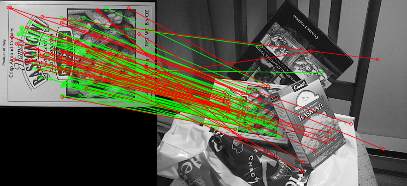
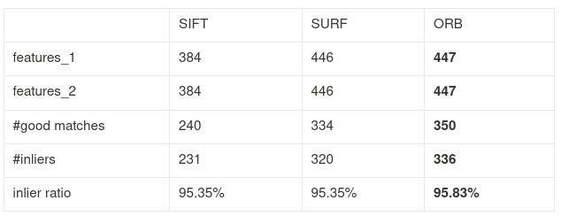
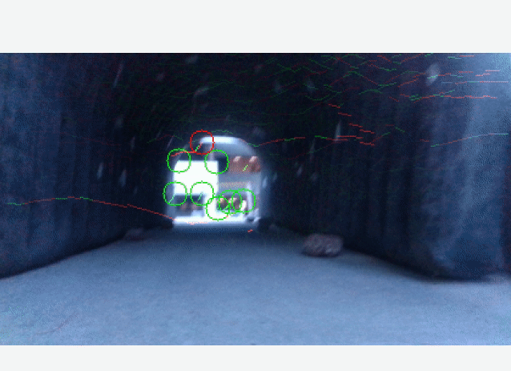
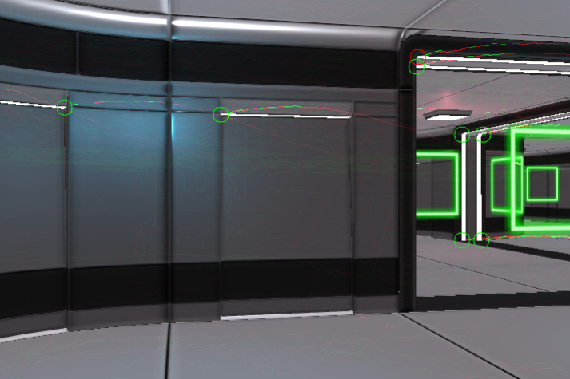

# What's this lab about?

### Feature Tracking

In this lab, I used opencv SIFT, SURF, and ORB features detectors and descriptors to track keypoints and compared their performances. For matching the keypoints, I have used a [FLANN-based matcher](https://docs.opencv.org/3.4/d5/d6f/tutorial_feature_flann_matcher.html) and Brute Force matcher.




### LK Tracker

Next, I used a different class of feature tracker, the LK Tracker, to track keypoints in a video taken from the on-board cam of a drone.





# Installation

1. Here are some extra dependencies that you might need for this code to work:

```
sudo apt-get update
sudo apt-get install libgoogle-glog-dev python-catkin-tools autoconf python-wstool libgtk2.0-dev pkg-config
```
2. Let us use catkin build to build the code:
```
cd {VNAV_HOME}/vnav_ws/
catkin clean -y
catkin build lab_5
```

Remember to source your workspace:
```
source {VNAV_HOME}/vnav_ws/devel/setup.bash
```

# Usage

1. To just compare feature trackers using a pair of images, run:
```
roslaunch lab_5 two_frames_tracking.launch
```

2. To run the feature tracking on a video sequence, we need to play the dataset rosbag (please see handout for details and link).
For this we provide another launch file.
```
roslaunch lab_5 video_tracking.launch path_to_dataset:=/.../your/path/here/file.bag
```


