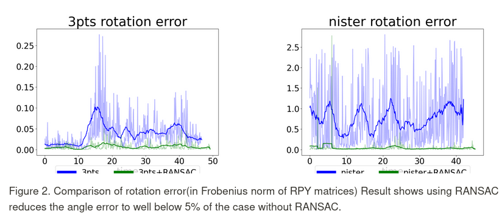

# What is this lab about?

### Essential Matrix and Relative Pose estimation

In this lab, I use [opengv](https://github.com/laurentkneip/opengv) to estimate the change in the camera's pose in the world from tracked features from lab 5. 

I implemented the simplest 8-point algorithm and the icp-like 3 points algorithm(which uses depth information), and compared the relative pose error to the nister 5 point algorithm in the opengv library.


### RANSAC 

To deal with outliers, I have implemented RANSAC and compared the relative error with and without RANSAC.



# Installation

1. Add new packages to your catkin workspace using wstool:
```
cd {VNAV_HOME}/vnav_ws/src/
cp -r {VNAV_HOME}/Labs/Lab_6 ./
wstool merge {VNAV_HOME}/vnav_ws/src/Lab_6/install/lab_6.rosinstall -y
wstool update -j8
```

2. Build lab_6:
```
catkin build lab_6
```

Remember to source your workspace:
```
source {VNAV_HOME}/vnav_ws/devel/setup.bash
```

# Usage

1. To run the pose estimation on the given rosbag, we will use:
```
roslaunch lab_6 video_tracking.launch
```

