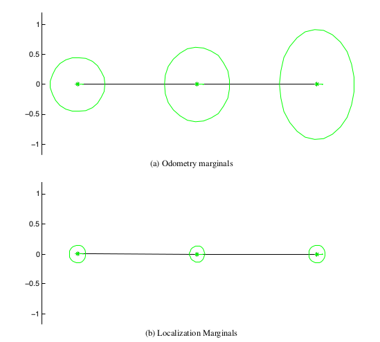
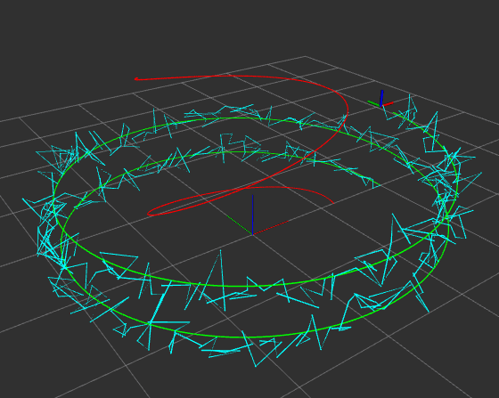

# What is this lab about?

### Deliverable 1. Odometry + GPS


### Deliverable 2, 3. optimizing a rough trajectory from odometry with indoor gps-like sensors (motion capture)


### Deliverable 4. A landmark SLAM using 4 landmarks and odometry data.

# Installation

0. Install packages that you might need:
```
sudo apt-get install libtbb-dev
```

1. Add new packages to your catkin workspace using wstool: (you might have to manually remove duplicated packages.)
```
cd {VNAV_HOME}/vnav_ws/src/
cp -r {VNAV_HOME}/Labs/lab7 ./
wstool merge --merge-replace {VNAV_HOME}/vnav_ws/src/lab7/install/lab_7.rosinstall -y
wstool update
```

2. Build lab_7:
```
catkin build gtsam_catkin
catkin build lab_7
```

Remember to source your workspace:
```
source {VNAV_HOME}/vnav_ws/devel/setup.bash
```

# Usage

1. In this lab, we will be using different executables, one for each deliverable, and we are not using more than one node at a time, therefore we will just use rosrun.
To run rosrun, you need first to launch roscore in a terminal.
```
roscore
```
then, in another terminal run:
```
rosrun lab_7 deliverable_n
```
where 
- n = 1: a simple odometry model

- n=2, 3: a odometry + motion capture(indoor gps sensor)

- n=4: landmark SLAM using projection factor

